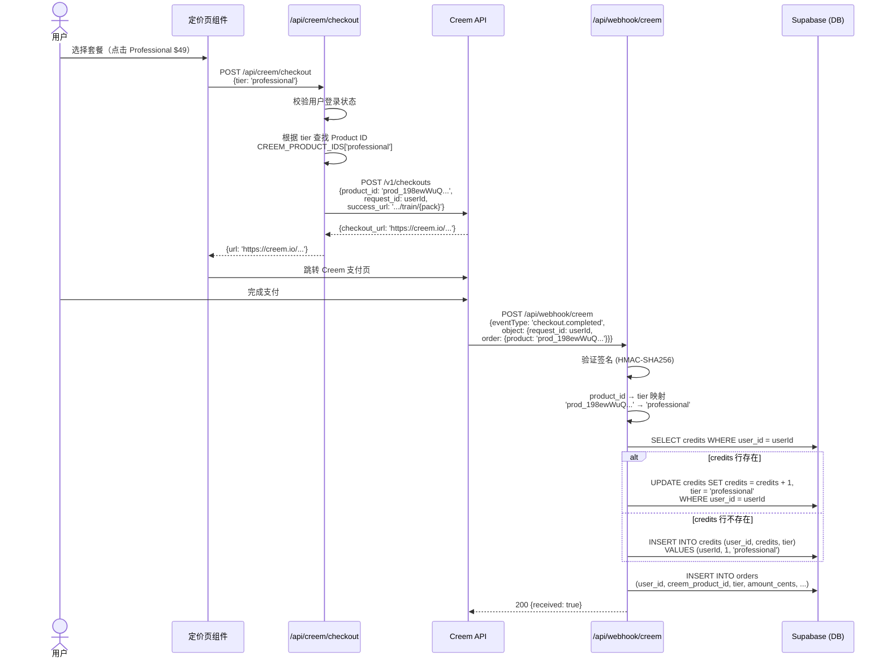
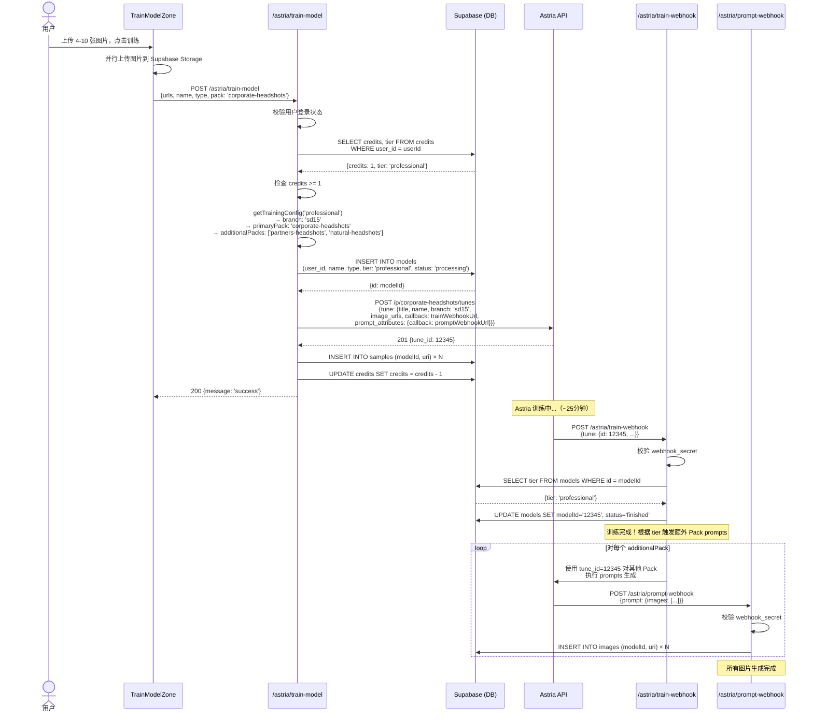
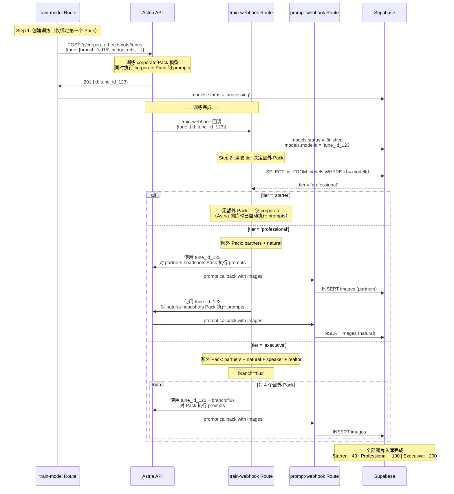
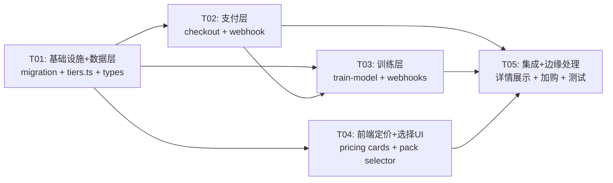

# SnapProHead 三档定价 — 系统架构设计文档

> **作者**：高见远（Bob）— 架构师
> **日期**：2026-05-28
> **版本**：v1.0
> **基于 PRD**：`docs/PRD.md`
> **项目路径**：`headshots-starter`

---

## 目录

1. [实现方案](#一实现方案)
2. [文件变更列表](#二文件变更列表)
3. [数据结构（数据库 Schema）](#三数据结构数据库-schema)
4. [接口设计（TypeScript 类型/常量）](#四接口设计typescript-类型常量)
5. [程序调用流程](#五程序调用流程)
6. [任务列表](#六任务列表)
7. [依赖包列表](#七依赖包列表)
8. [共享知识（跨文件约定）](#八共享知识跨文件约定)
9. [任务依赖图](#九任务依赖图)
10. [待明确事项](#十待明确事项)

---

## 一、实现方案

### 1.1 整体架构

```
┌──────────────────────────────────────────────────┐
│                    前端 (React)                     │
│  ┌─────────────┐  ┌──────────────┐  ┌───────────┐ │
│  │ 三档定价卡片 │  │ Pack 风格选择 │  │ 训练上传   │ │
│  │ (Pricing)   │  │ (PackPicker) │  │ (TrainZone)│ │
│  └──────┬──────┘  └──────┬───────┘  └─────┬─────┘ │
│         │                │                │        │
└─────────┼────────────────┼────────────────┼────────┘
          │                │                │
┌─────────┼────────────────┼────────────────┼────────┐
│         ▼                │                ▼        │
│  ┌─────────────┐         │    ┌──────────────────┐ │
│  │Creem Checkout│         │    │ train-model Route│ │
│  │ POST route   │         │    │ (读取 tier →     │ │
│  │ (按 tier 选   │         │    │  决定 Pack 数/   │ │
│  │  Product ID) │         │    │  模型分支)       │ │
│  └──────┬──────┘         │    └────────┬─────────┘ │
│         │                │             │           │
│  ┌──────▼──────┐         │    ┌────────▼─────────┐ │
│  │Creem Webhook│         │    │  Astria API       │ │
│  │ (product_id │         │    │  POST /p/{slug}/  │ │
│  │  → tier+)   │         │    │  tunes            │ │
│  └──────┬──────┘         │    └────────┬─────────┘ │
│         │                │             │           │
│         ▼                │             ▼           │
│  ┌──────────────────────────────────────────────┐  │
│  │            Supabase (PostgreSQL)               │  │
│  │  ┌─────────┐  ┌──────────┐  ┌──────────────┐ │  │
│  │  │ models  │  │ credits  │  │   orders      │ │  │
│  │  │ +tier   │  │ +tier    │  │   (新增)      │ │  │
│  │  └─────────┘  └──────────┘  └──────────────┘ │  │
│  └──────────────────────────────────────────────┘  │
│                                                     │
│                    Next.js 14 API Routes             │
└─────────────────────────────────────────────────────┘
```

### 1.2 核心设计决策

| 决策 | 选择 | 理由 |
|------|------|------|
| 多 Pack 训练策略 | **方案 A**：1 次 tune → 多 Pack prompts 复用 | PRD 确认。节省 Astria 训练费用（~/pack），约 $3-5/次训练费 |
| Professional 的 3 个 Pack | **固定**：corporate + partners + natural | PRD 用户决策。降低选择复杂度，提升转化率 |
| Starter 的 Pack | **固定**：corporate-headshots | PRD 用户决策。简化 MVP |
| Executive 的 Pack | **5 个全部**：corporate + partners + natural + speaker + realtor | 全量覆盖 |
| 模型分支（branch） | Starter/Professional → `"sd15"`，Executive → `"flux"` | PRD 画质差异要求 |
| tier 存储策略 | **双写**：models.tier + credits.tier + orders 表 | credits.tier 用于 UI 展示当前级别；models.tier 用于训练记录追溯；orders 表独立审计 |
| 支付网关 | 保持 **Creem**（不引入 Stripe） | 已有 Stripe 兜底代码但 CREEM_IS_ENABLED 控制 |

### 1.3 技术栈（保持不变）

- **前端**：Next.js 14 (App Router) + React + Tailwind CSS + shadcn/ui + Zod + React Hook Form
- **后端**：Next.js Route Handlers (API Routes)
- **数据库**：Supabase (PostgreSQL) + Row Level Security
- **AI 服务**：Astria API (Packs + Tunes)
- **支付**：Creem Checkout + Webhook
- **部署**：Vercel

### 1.4 多 Pack 训练流程（方案 A）

```
用户上传图片 → train-model Route
  ↓
Step 1：创建 1 次 Astria tune（绑定第一个 Pack：corporate-headshots）
  POST /p/corporate-headshots/tunes
  {
    tune: {
      title: name,
      name: type,
      branch: tier==='executive' ? 'flux' : 'sd15',
      image_urls: [...],
      callback: trainWebhookUrl,
      prompt_attributes: { callback: promptWebhookUrl }
    }
  }
  ↓ Astria 训练完成后 → train-webhook 回调
  ↓
Step 2：train-webhook 更新 models.status='finished', models.modelId=tune_id
  ↓
Step 3：train-webhook 使用同一 tune_id 对其他 Pack 执行 prompts
  （根据 tier 决定额外 Pack 列表）
  ├─ starter：无额外（仅 corporate）
  ├─ professional：partners-headshots, natural-headshots
  └─ executive：partners-headshots, natural-headshots, speaker, realtor
  ↓
  调用 Astria Pack prompts 接口（使用已训练的 tune_id）
  ↓ prompt-webhook 回调 → 逐批存储图片到 Supabase images 表
```

> **关键点**：第一个 Pack（corporate-headshots）的 prompts 由 Astria 在训练时自动执行。额外 Pack 的 prompts 由 train-webhook 在训练完成后主动触发。

---

## 二、文件变更列表

### 2.1 需要修改的文件

| # | 文件路径 | 变更类型 | 变更说明 |
|---|---------|---------|---------|
| 1 | `lib/pricing.ts` | **重写** | 定义三档定价常量、Product ID 映射、tier→Pack 映射、tier→prompt 数量映射 |
| 2 | `types/supabase.ts` | **修改** | models.Row/Insert 增加 `tier` 字段；credits.Row/Insert 增加 `tier` 字段；新增 orders 表类型 |
| 3 | `app/api/creem/checkout/route.ts` | **修改** | 接收 `tier` 参数，根据 tier 选择对应 Product ID；success_url 适配 |
| 4 | `app/api/webhook/creem/route.ts` | **修改** | 根据 product_id 映射 tier；写入 credits.tier 和 orders 表 |
| 5 | `app/astria/train-model/route.ts` | **重写** | 读取 credits.tier → 决定 pack、branch（sd15/flux）；model 插入时写入 tier |
| 6 | `app/astria/train-webhook/route.ts` | **修改** | 训练完成后根据 models.tier 触发额外 Pack 的 prompts 执行 |
| 7 | `app/astria/prompt-webhook/route.ts` | **修改** | 无需大改，接收额外 Pack 的 prompt 回调即可 |
| 8 | `components/homepage/modern-pricing.tsx` | **重写** | 三档定价卡片 + 套餐对比表 |
| 9 | `components/TrainModelZone.tsx` | **修改** | 根据 tier 显示可选 Pack 数量和名称 |
| 10 | `components/homepage/PricingSection.tsx` | **修改** | 替换为新的三档定价组件引用 |
| 11 | `app/packs/[slug]/page.tsx` | **修改** | 移除硬编码价格 $29，展示套餐对应价格；自选场景限制 Pack 范围 |

### 2.2 需要新增的文件

| # | 文件路径 | 用途 |
|---|---------|------|
| 1 | `lib/tiers.ts` | tier 常量、Pack 映射、Product ID 映射、辅助函数 |
| 2 | `supabase/migrations/20260528_add_tier.sql` | 数据库迁移：ALTER models/credits + CREATE orders |
| 3 | `components/homepage/tier-comparison-table.tsx` | 套餐对比表组件（P1） |
| 4 | `components/packs/tier-pack-selector.tsx` | 基于 tier 的 Pack 选择器（显示可选 Pack 及数量限制） |
| 5 | `app/api/creem/addon-checkout/route.ts` | 加购结算 API（P1-5） |

### 2.3 不需要修改的关键文件

| 文件 | 原因 |
|------|------|
| `app/astria/train-model/image-upload/route.ts` | 图片上传逻辑不变 |
| `app/api/stripe/*` | Stripe 通道保持不动，Creem 为主要支付 |
| `components/ImageInspector.tsx` | 图片检测逻辑不变 |
| `app/overview/models/*` | 训练后查看页面，只需展示 tier 信息（轻改） |
| `lib/imageInspection.ts` | 特征检测逻辑不变 |

---

## 三、数据结构（数据库 Schema）

### 3.1 迁移 SQL（新增文件）

```sql
-- supabase/migrations/20260528_add_tier.sql
-- 描述：三档定价所需的数据库变更

-- ============================================
-- 1. models 表：新增 tier 字段
-- ============================================
ALTER TABLE public.models
ADD COLUMN IF NOT EXISTS tier TEXT DEFAULT 'starter' NOT NULL;

-- 约束：tier 仅允许三个枚举值
ALTER TABLE public.models
ADD CONSTRAINT models_tier_check
CHECK (tier IN ('starter', 'professional', 'executive'));

-- ============================================
-- 2. credits 表：新增 tier 字段
-- ============================================
ALTER TABLE public.credits
ADD COLUMN IF NOT EXISTS tier TEXT DEFAULT 'starter' NOT NULL;

ALTER TABLE public.credits
ADD CONSTRAINT credits_tier_check
CHECK (tier IN ('starter', 'professional', 'executive'));

-- ============================================
-- 3. orders 表（新增）：独立记录每次支付
-- ============================================
CREATE TABLE IF NOT EXISTS public.orders (
    id BIGINT GENERATED ALWAYS AS IDENTITY PRIMARY KEY,
    user_id UUID NOT NULL REFERENCES auth.users(id) ON DELETE CASCADE,
    creem_checkout_id TEXT,
    creem_product_id TEXT NOT NULL,
    tier TEXT NOT NULL,
    amount_cents INTEGER NOT NULL,
    currency TEXT DEFAULT 'USD',
    status TEXT DEFAULT 'paid',
    raw_payload JSONB,
    created_at TIMESTAMPTZ DEFAULT now() NOT NULL
);

-- orders 表 RLS
ALTER TABLE public.orders ENABLE ROW LEVEL SECURITY;

-- 用户可查看自己的订单
CREATE POLICY "Users can view own orders"
ON public.orders FOR SELECT TO authenticated
USING (auth.uid() = user_id);

-- 仅 service_role 可写入
CREATE POLICY "Service role can insert orders"
ON public.orders FOR INSERT TO service_role
WITH CHECK (true);

-- ============================================
-- 4. 现有用户数据迁移：将已有付费用户设为 starter
-- ============================================
UPDATE public.credits SET tier = 'starter' WHERE tier IS NULL;
UPDATE public.models SET tier = 'starter' WHERE tier IS NULL;

-- ============================================
-- 5. 索引
-- ============================================
CREATE INDEX IF NOT EXISTS idx_models_tier ON public.models(tier);
CREATE INDEX IF NOT EXISTS idx_credits_tier ON public.credits(tier);
CREATE INDEX IF NOT EXISTS idx_orders_user_id ON public.orders(user_id);
CREATE INDEX IF NOT EXISTS idx_orders_created_at ON public.orders(created_at);
```

### 3.2 迁移后的表结构概览

```
models 表（变更后）
┌────────────┬──────────┬────────────────────────────────┐
│ 字段       │ 类型     │ 说明                           │
├────────────┼──────────┼────────────────────────────────┤
│ id         │ BIGINT   │ PK                             │
│ user_id    │ UUID     │ FK → auth.users                │
│ name       │ TEXT     │ 模型名称                       │
│ type       │ TEXT     │ man/woman/person               │
│ status     │ TEXT     │ processing/finished/error      │
│ modelId    │ TEXT     │ Astria tune_id                 │
│ tier       │ TEXT ⭐   │ starter/professional/executive │
│ created_at │ TIMESTAMPTZ│                               │
└────────────┴──────────┴────────────────────────────────┘

credits 表（变更后）
┌────────────┬──────────┬────────────────────────────────┐
│ 字段       │ 类型     │ 说明                           │
├────────────┼──────────┼────────────────────────────────┤
│ id         │ BIGINT   │ PK                             │
│ user_id    │ UUID     │ FK → auth.users, UNIQUE        │
│ credits    │ INTEGER  │ 可用训练次数                   │
│ tier       │ TEXT ⭐   │ 当前最高购买档位               │
│ created_at │ TIMESTAMPTZ│                               │
└────────────┴──────────┴────────────────────────────────┘

orders 表（新建）
┌───────────────────┬──────────┬──────────────────────────────┐
│ 字段              │ 类型     │ 说明                         │
├───────────────────┼──────────┼──────────────────────────────┤
│ id                │ BIGINT   │ PK                           │
│ user_id           │ UUID     │ FK → auth.users              │
│ creem_checkout_id │ TEXT     │ Creem checkout ID            │
│ creem_product_id  │ TEXT     │ Creem 产品 ID                │
│ tier              │ TEXT     │ starter/professional/executive│
│ amount_cents      │ INTEGER  │ 支付金额（分）               │
│ currency          │ TEXT     │ 币种，默认 USD               │
│ status            │ TEXT     │ paid/refunded                │
│ raw_payload       │ JSONB    │ 完整 webhook payload         │
│ created_at        │ TIMESTAMPTZ│                             │
└───────────────────┴──────────┴──────────────────────────────┘
```

---

## 四、接口设计（TypeScript 类型/常量）

### 4.1 `lib/tiers.ts`（新增文件 — 核心常量与类型）

```typescript
// ============================================
// 套餐档位类型
// ============================================
export type Tier = 'starter' | 'professional' | 'executive';

// ============================================
// 三档定价常量
// ============================================
export interface TierInfo {
  tier: Tier;
  name: string;           // 显示名称
  price: number;          // 美元价格
  priceLabel: string;     // 价格标签
  packCount: number;      // 可选 Pack 数
  packSlugs: string[];    // 固定 Pack slug 列表
  modelBranch: 'sd15' | 'flux';
  resolution: string;     // 分辨率描述
  estimatedImages: string;// 预估出图数
  estimatedTime: string;  // 预估时间
  badge?: string;         // 推荐标签（如 "Most Popular"）
  features: string[];     // 特性列表
}

export const TIERS: Record<Tier, TierInfo> = {
  starter: {
    tier: 'starter',
    name: 'Starter',
    price: 29,
    priceLabel: '$29',
    packCount: 1,
    packSlugs: ['corporate-headshots'],
    modelBranch: 'sd15',
    resolution: '512×768',
    estimatedImages: '~40 张',
    estimatedTime: '~25 分钟',
    features: [
      '1 种职业风格（商务正装）',
      '约 40 张 AI 头像',
      '标准分辨率 512×768',
      '~25 分钟交付',
      '商业授权',
      '30 天自动删除保护隐私',
    ],
  },
  professional: {
    tier: 'professional',
    name: 'Professional',
    price: 49,
    priceLabel: '$49',
    packCount: 3,
    packSlugs: ['corporate-headshots', 'partners-headshots', 'natural-headshots'],
    modelBranch: 'sd15',
    resolution: '512×768',
    estimatedImages: '~100 张',
    estimatedTime: '~25 分钟',
    badge: 'Most Popular',
    features: [
      '3 种职业风格（商务 + 法律 + 自然）',
      '约 100 张 AI 头像',
      '标准分辨率 512×768',
      '~25 分钟交付',
      '商业授权',
      '30 天自动删除保护隐私',
    ],
  },
  executive: {
    tier: 'executive',
    name: 'Executive',
    price: 89,
    priceLabel: '$89',
    packCount: 5,
    packSlugs: [
      'corporate-headshots',
      'partners-headshots',
      'natural-headshots',
      'speaker',
      'realtor',
    ],
    modelBranch: 'flux',
    resolution: '1024×1024',
    estimatedImages: '~200 张',
    estimatedTime: '~25 分钟',
    badge: 'Best Value',
    features: [
      '5 种职业风格（全部）',
      '约 200 张 AI 头像',
      '增强分辨率 1024×1024 (Flux)',
      '~25 分钟快速交付',
      '商业授权',
      '30 天自动删除保护隐私',
    ],
  },
};

// ============================================
// Creem Product ID 映射
// ============================================
export const CREEM_PRODUCT_IDS: Record<Tier, string> = {
  starter:      'prod_31zqeJaVi4nCiCLGPz0F2K',
  professional: 'prod_198ewWuQouDaQfEOT6kTvj',
  executive:    'prod_1pZIlgHsKVk5YOK1QupnPP',
};

// 反向映射：product_id → tier
export const PRODUCT_ID_TO_TIER: Record<string, Tier> = {
  'prod_31zqeJaVi4nCiCLGPz0F2K': 'starter',
  'prod_198ewWuQouDaQfEOT6kTvj': 'professional',
  'prod_1pZIlgHsKVk5YOK1QupnPP': 'executive',
};

// ============================================
// tier → 训练参数映射
// ============================================
export function getTrainingConfig(tier: Tier) {
  const info = TIERS[tier];
  return {
    branch: info.modelBranch,
    primaryPack: info.packSlugs[0],       // 训练绑定的主 Pack
    additionalPacks: info.packSlugs.slice(1), // 训练完成后额外执行的 Pack
  };
}

// ============================================
// 辅助函数
// ============================================
export function isTier(value: string): value is Tier {
  return ['starter', 'professional', 'executive'].includes(value);
}

export function getTierInfo(tier: Tier): TierInfo {
  return TIERS[tier];
}

export function getCreemProductId(tier: Tier): string {
  return CREEM_PRODUCT_IDS[tier];
}

export function tierFromProductId(productId: string): Tier {
  return PRODUCT_ID_TO_TIER[productId] || 'starter';
}
```

### 4.2 `types/supabase.ts`（修改部分 — 仅展示新增/变更）

```typescript
// === models 表 ===
// Row 新增
tier: string  // 'starter' | 'professional' | 'executive'

// Insert 新增
tier?: string

// Update 新增
tier?: string

// === credits 表 ===
// Row 新增
tier: string  // 'starter' | 'professional' | 'executive'

// Insert 新增
tier?: string

// Update 新增
tier?: string

// === orders 表（新增） ===
orders: {
  Row: {
    id: number
    user_id: string
    creem_checkout_id: string | null
    creem_product_id: string
    tier: string
    amount_cents: number
    currency: string
    status: string
    raw_payload: Json | null
    created_at: string
  }
  Insert: {
    id?: number
    user_id: string
    creem_checkout_id?: string | null
    creem_product_id: string
    tier: string
    amount_cents: number
    currency?: string
    status?: string
    raw_payload?: Json | null
    created_at?: string
  }
  Update: { /* ... */ }
  Relationships: [
    {
      foreignKeyName: "orders_user_id_fkey"
      columns: ["user_id"]
      referencedRelation: "users"
      referencedColumns: ["id"]
    }
  ]
}
```

### 4.3 `lib/pricing.ts`（重写后）

```typescript
/**
 * SnapProHead 三档定价常量
 * 重新导出 tiers.ts 中的核心数据以保持向后兼容
 */
export { TIERS, CREEM_PRODUCT_IDS, type Tier, type TierInfo, getTierInfo } from './tiers';

// 向后兼容：保留单包价格（最低档）
export const PRICING = {
  single: { price: 29 },   // Starter
  professional: { price: 49 },
  executive: { price: 89 },
} as const;

// 向后兼容：默认产品 ID
export const PRODUCT_IDS = {
  single: 'prod_31zqeJaVi4nCiCLGPz0F2K',  // Starter
} as const;
```

---

## 五、程序调用流程

### 5.1 支付流程（选套餐 → Creem → Webhook → 写入 tier）



### 5.2 训练流程（读取 tier → Astria API 调用 → Webhook 回调）



### 5.3 多 Pack 复用流程（1 次 tune → 多 Pack prompts — 方案 A 详细）



---

## 六、任务列表

### T01：项目基础设施 + 数据层

| 属性 | 值 |
|------|-----|
| **任务编号** | T01 |
| **描述** | 数据库迁移 + 类型定义 + 核心常量 |
| **涉及文件** | `supabase/migrations/20260528_add_tier.sql`（新增）、`lib/tiers.ts`（新增）、`lib/pricing.ts`（重写）、`types/supabase.ts`（修改） |
| **前置任务** | 无 |
| **优先级** | P0 |
| **预计复杂度** | ⭐⭐（中等 — 需理解现有 schema、保证向后兼容） |
| **详细说明** | 1. 编写迁移 SQL（ALTER models/credits + CREATE orders + 索引 + 策略）；2. 编写 `lib/tiers.ts` 核心常量（TIERS、CREEM_PRODUCT_IDS、辅助函数）；3. 重写 `lib/pricing.ts` 保持向后兼容导出；4. 更新 `types/supabase.ts` 新增 tier 字段和 orders 表类型定义 |

### T02：支付层改造

| 属性 | 值 |
|------|-----|
| **任务编号** | T02 |
| **描述** | Creem 多产品支付：checkout + webhook |
| **涉及文件** | `app/api/creem/checkout/route.ts`（修改）、`app/api/webhook/creem/route.ts`（修改） |
| **前置任务** | T01（依赖 tiers 常量和 Product ID 映射） |
| **优先级** | P0 |
| **预计复杂度** | ⭐⭐（中等 — 需处理旧 product_id 兼容） |
| **详细说明** | 1. checkout route：接收 `tier` 参数 → 映射到 Product ID → 创建 Creem checkout；兼容旧的 `pack` 参数；2. webhook route：product_id → tier 映射 → 双写 credits.tier + orders 表；兼容旧的单一 product_id |

### T03：训练层改造

| 属性 | 值 |
|------|-----|
| **任务编号** | T03 |
| **描述** | train-model + train-webhook + prompt-webhook 适配多 Pack 方案 A |
| **涉及文件** | `app/astria/train-model/route.ts`（修改）、`app/astria/train-webhook/route.ts`（修改）、`app/astria/prompt-webhook/route.ts`（轻微修改） |
| **前置任务** | T01, T02（依赖 credits.tier 可读） |
| **优先级** | P0 |
| **预计复杂度** | ⭐⭐⭐（复杂 — 多 Pack 执行逻辑、错误处理、rollback） |
| **详细说明** | 1. train-model：读取 credits.tier → 决定 branch（sd15/flux）和 packSlugs → 模型 insert 写入 tier → 调用 Astria API；2. train-webhook：模型训练完成后，根据 models.tier 触发额外 Pack 的 prompts 执行（调用 Astria 使用同一 tune_id）；3. prompt-webhook：保持现有逻辑，接收所有 Pack 的 prompt 回调 |

### T04：前端定价 + 选择 UI

| 属性 | 值 |
|------|-----|
| **任务编号** | T04 |
| **描述** | 三档定价卡片 + 套餐对比表 + Pack 选择 UI |
| **涉及文件** | `components/homepage/modern-pricing.tsx`（重写）、`components/homepage/tier-comparison-table.tsx`（新增）、`components/packs/tier-pack-selector.tsx`（新增）、`components/TrainModelZone.tsx`（修改）、`app/packs/[slug]/page.tsx`（修改） |
| **前置任务** | T01（依赖 TIERS 常量） |
| **优先级** | P0（定价卡片）+ P1（对比表和 Pack 选择器） |
| **预计复杂度** | ⭐⭐⭐（复杂 — UI 组件多、状态管理、响应式设计） |
| **详细说明** | 1. modern-pricing.tsx 重写为三档卡片（高亮 Professional、标签、CTA 按钮传入 tier）；2. tier-comparison-table.tsx 对比表；3. TrainModelZone.tsx 读取用户 tier → 显示可选 Pack；4. packs/[slug]/page.tsx 移除硬编码 $29，适配 tier 上下文的已有训练流程 |

### T05：集成 + 边缘处理 + 加购入口

| 属性 | 值 |
|------|-----|
| **任务编号** | T05 |
| **描述** | 训练详情展示 tier + 边界 case 处理 + 加购入口 |
| **涉及文件** | `app/overview/models/*`（轻改）、`app/api/creem/addon-checkout/route.ts`（新增，P1-5）、`components/homepage/PricingSection.tsx`（修改引用）、`app/page.tsx`（集成验证） |
| **前置任务** | T01, T02, T03, T04 |
| **优先级** | P1 |
| **预计复杂度** | ⭐⭐（中等 — 集成测试、边界处理、加购流程） |
| **详细说明** | 1. 模型详情页显示 "Professional 套餐 - 3 种风格"；2. 处理边界：credits.tier 为旧值/空值 → 默认 starter；同一用户重复购买 → tier 升级逻辑（不降级）；3. 加购 API（已购用户追加购买，直接加 credits+tier 到 credits 表）；4. 最终集成测试 |

---

## 七、依赖包列表

### 7.1 无需新增 npm 包

当前技术栈已完全覆盖需求，无需安装新的依赖包：

```
已使用的包（无需新增）：
- next@^14.x          : 框架
- react@^18.x         : UI 库
- tailwindcss@^3.x    : 样式
- @supabase/ssr       : Supabase 服务端/客户端
- @supabase/supabase-js : Supabase SDK
- zod                 : 表单校验（已在用）
- @hookform/resolvers : React Hook Form 适配器（已在用）
- react-hook-form     : 表单状态管理（已在用）
- react-dropzone      : 文件拖放上传（已在用）
- axios               : HTTP 客户端（已在用）
- resend              : 邮件发送（已在用）
- lucide-react        : 图标库（已在用）
- react-icons         : 图标库（已在用）
- clsx + tailwind-merge : 样式工具（已在用）
```

### 7.2 可选新增（如后续需要动画或 toast 增强）

```
无必须新增项。如有 P2 动画对比需求，可考虑：
- framer-motion  : 定价卡片切换动画（可选）
```

---

## 八、共享知识（跨文件约定）

### 8.1 tier 常量的唯一数据源

- **所有 tier 常量定义在 `lib/tiers.ts`**，其他文件通过 `import { TIERS, ... } from '@/lib/tiers'` 引用
- 禁止在组件或 route 中硬编码 tier 字符串、Pack slug 列表、价格

### 8.2 tier 流转路径

```
Creem Product ID ──→ lib/tiers.ts (PRODUCT_ID_TO_TIER) ──→ webhook 写入
                                                                   │
                                              ┌────────────────────┘
                                              ▼
                                     credits.tier ──→ train-model 读取
                                     models.tier  ──→ train-webhook 读取
                                     orders.tier  ──→ 审计/回溯
```

### 8.3 向后兼容规则

- **旧 product_id** (`prod_6F4zKTNhL3V7vWPUhnjZDZ`)：webhook 中若无法映射到 tier，默认 → `'starter'`
- **旧 credits 行**（无 tier 字段）：迁移 SQL 自动填充 `'starter'`，代码中 `tier || 'starter'` 兜底
- **旧 models 行**（无 tier 字段）：同上
- **旧 checkout 不带 tier 参数**：默认使用 `'starter'` → Product ID `prod_31zqeJaVi4nCiCLGPz0F2K`

### 8.4 tier 升级规则

- 用户已购 Starter，再购 Professional → credits.tier 升级为 `'professional'`，credits + 1
- 用户已购 Professional，再购 Starter → credits.tier **保持** `'professional'`（不降级），credits + 1
- tier 比较：`starter < professional < executive`

### 8.5 错误处理约定

- Astria API 调用失败：catch 中回滚 models 记录（已有逻辑，保留）
- 额外 Pack 执行失败：记录日志，不阻塞主流程（train-webhook 中 try-catch 每个额外 Pack）
- Webhook 重复通知：利用 orders.creem_checkout_id 去重（idempotency）

### 8.6 环境变量

```
# 新增（无需）— 现有变量足够
# 确认以下变量存在且正确：
CREEM_API_KEY=xxx
CREEM_WEBHOOK_SECRET=xxx
ASTRIA_API_KEY=xxx
ASTRIA_TEST_MODE=false
APP_WEBHOOK_SECRET=xxx
DEPLOYMENT_URL=https://snapprohead.com  # 生产环境 webhook 回调地址
```

---

## 九、任务依赖图



> **并行提示**：T02 和 T04 可在 T01 完成后并行开发（互不依赖）。T03 需要 T02 完成（依赖 webhook 写入 tier）。T05 最后串联。

---

## 十、待明确事项

| # | 问题 | 影响 | 当前假设 |
|---|------|------|---------|
| Q1 | **train-webhook 触发额外 Pack prompts 的 Astria API 端点**：Astria 是否支持用已有 tune_id 对不同 Pack 执行 prompts？需要确认具体 API 调用方式 | 方案 A 可行性 | 假设支持：POST `/p/{pack_slug}/tunes/{tune_id}/prompts` 或类似端点。需查阅 Astria 文档确认 |
| Q2 | **额外 Pack 的 prompts 是否异步**：train-webhook 中触发额外 Pack 是同步等待还是 fire-and-forget？ | train-webhook 的实现方式 | 建议 fire-and-forget（触发后由 prompt-webhook 回调），避免 train-webhook 超时 |
| Q3 | **Executive Flux 模型的 Astria 计费差异**：Flux 训练成本是否显著高于 SD1.5？ | Executive 定价合理性（$89） | 需查阅 Astria 文档，假设可接受 |
| Q4 | **分辨率增强实现方式**：1024×1024 是通过 prompt params 还是 pack 配置？ | Executive 画质承诺 | 假设通过 pack 配置或 prompt `width/height` 参数控制 |
| Q5 | **加购后是否复用已有 tune**：已购 Starter 用户加购 Professional，是否需要重新训练？ | 加购 UX 和训练流程 | 建议复用已有 tune_id（若用户已有已完成模型），对新 Pack 执行 prompts |
| Q6 | **orders 表的 webhook 去重机制**：同一 checkout 可能多次回调 | 数据一致性 | 方案：利用 `creem_checkout_id` UNIQUE 约束 + INSERT ON CONFLICT DO NOTHING |
| Q7 | **旧 product_id `prod_6F4zKTNhL3V7vWPUhnjZDZ` 的处理**：该产品在 Creem 中是否已废弃？ | Webhook 兼容逻辑 | 假设保留映射：`prod_6F4zKTNhL3V7vWPUhnjZDZ` → `starter` |

---

## 附录 A：Astria API 关键端点参考

| 端点 | 用途 | 关键参数 |
|------|------|---------|
| `POST /p/{pack_slug}/tunes` | 创建 Pack 训练 | `tune.title`, `tune.name`, `tune.branch` ("sd15"/"flux"), `tune.image_urls`, `tune.callback`, `tune.prompt_attributes.callback` |
| `POST /tunes` | 创建普通 tune（不用 Pack） | `tune.base_tune_id`, `tune.branch`, `tune.prompts_attributes` |
| Pack prompts 执行（待确认） | 对已有 tune 执行其他 Pack 的 prompts | `tune_id`, `pack_slug`, `pack_prompt_ids`（可选子集） |

---

## 附录 B：Pack 列表与出图量参考

| Pack Slug | 显示名称 | 女性出图 | 男性出图 | 所属套餐 |
|-----------|---------|---------|---------|---------|
| `corporate-headshots` | Corporate Headshots | 56 | 52 | 全部 |
| `partners-headshots` | Partner's Headshots | 44 | 40 | Professional, Executive |
| `natural-headshots` | Natural Looks | 44 | — | Professional, Executive |
| `speaker` | Speaker | 29 | 19 | Executive |
| `realtor` | Realtor | 19 | 20 | Executive |

---

*架构设计文档结束。请查阅 `docs/class-diagram.mermaid` 和 `docs/sequence-diagram.mermaid` 获取完整的类图和时序图。*
