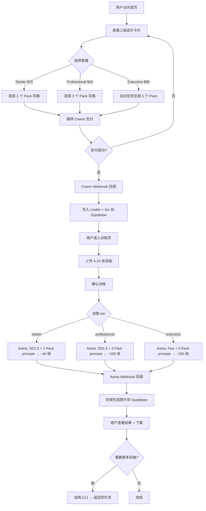

# SnapProHead 三档定价 + 分级训练 PRD

> 项目: SnapProHead — AI 职业头像 SaaS
> 版本: v1.0
> 日期: 2026-05-26
> 作者: 许清楚（产品经理）

---

## 一、项目信息

| 字段 | 值 |
|------|-----|
| 语言 | 中文 |
| 技术栈 | Next.js 14 + Supabase + Astria API + Creem 支付 + Vercel |
| 项目名 | headshots-starter |
| 原始需求 | 将现有单一 $29/次 定价改造为类似 Aragon AI 的多档定价模式，实现分级出图、分级风格选择、分级模型质量 |

---

## 二、产品定义

### 2.1 产品目标

1. **提升客单价与收入**：通过三档定价引导用户选择中高档套餐，预期 ARPU 从 $29 提升至 $45+
2. **差异化价值感知**：让用户清晰感知不同档位的价值差异（出图量、风格数、画质、速度），降低决策犹豫
3. **技术实现最小化**：基于现有 Astria Pack 的 `pack_prompt_ids` 能力实现分级，不引入新的训练架构

### 2.2 目标用户

- 职场人士：需要 LinkedIn 头像、公司内网头像
- 求职者：面试/简历需要职业形象
- 自由职业者/创业者：多场景多风格头像需求
- 房产经纪人/律师/讲师：行业特定风格需求

### 2.3 用户故事

1. **As a** 职场新人, **I want** 用最低价格体验 AI 头像 **so that** 我能在预算内获得至少一种职业风格的头像
2. **As a** 求职者, **I want** 选择中档套餐获得多种风格 **so that** 我能同时拥有 LinkedIn、简历、社交媒体等不同场景的头像
3. **As a** 资深专业人士, **I want** 购买高档套餐获得全部风格和最高画质 **so that** 我的头像在各平台都能呈现最佳专业形象
4. **As a** 已付费用户, **I want** 在训练前看到所选套餐的具体包含内容 **so that** 我确认付费与预期一致
5. **As a** 回访用户, **I want** 加购更多风格而无需重新训练 **so that** 我能以更低成本扩展头像库

---

## 三、三档定价方案

### 3.1 套餐定义

| 维度 | Starter | Professional ⭐推荐 | Executive |
|------|---------|-------------------|-----------|
| **价格** | $29 | $49 | $89 |
| **出图数** | ~40 张 | ~100 张 | ~200 张 |
| **Pack 风格数** | 1 个 Pack | 3 个 Pack | 5 个 Pack（全部） |
| **AI 模型** | SD1.5（标准） | SD1.5（标准） | Flux（增强画质+速度） |
| **生成时间** | ~45 分钟 | ~40 分钟 | ~25 分钟 |
| **分辨率** | 标准（512×768） | 标准（512×768） | 增强（1024×1024） |
| **推荐标签** | — | Most Popular | Best Value |
| **单张成本** | ~$0.73/张 | ~$0.49/张 | ~$0.45/张 |

### 3.2 定价逻辑

- **Starter $29**：保持现有价格不变，降低用户入门门槛。选 1 个 Pack，约 40 张出图
- **Professional $49**：核心盈利档位，预计 70%+ 用户选择。3 个 Pack 涵盖最常用场景（corporate + partners + natural），约 100 张
- **Executive $89**：高端全覆盖，全部 5 个 Pack + Flux 模型 + 高分辨率，约 200 张

### 3.3 与竞品对比

| 维度 | Aragon Basic ($35-44) | SnapProHead Starter ($29) |
|------|----------------------|--------------------------|
| 出图数 | 40 | ~40 |
| 风格 | 1 套服装 | 1 个 Pack |
| 价格 | $35-44 | **$29** ✅ 更低 |

| 维度 | Aragon Standard ($45-56) | SnapProHead Professional ($49) |
|------|-------------------------|-------------------------------|
| 出图数 | 60 | **~100** ✅ 更多 |
| 风格 | 2 套服装 | **3 个 Pack** ✅ 更丰富 |
| 价格 | $45-56 | $49 居中 |

| 维度 | Aragon Executive ($75-94) | SnapProHead Executive ($89) |
|------|--------------------------|-----------------------------|
| 出图数 | 100 | **~200** ✅ 显著更多 |
| 风格 | 全部 | **5 个 Pack 全部** |
| 画质 | 标准 | **Flux 增强** ✅ |

---

## 四、Astria Pack 与套餐映射

### 4.1 现有 Pack 出图量（参考）

| Pack Slug | 女性 | 男性 | 单次训练成本 |
|-----------|------|------|-------------|
| corporate-headshots | 56 | 52 | ~$4.4 |
| partners-headshots | 44 | 40 | ~$3.9 |
| natural-headshots | 44 | — | ~$4.0 |
| speaker | 29 | 19 | ~$3.2 |
| realtor | 19 | 20 | ~$3.0 |

### 4.2 套餐→Pack 映射规则

| 套餐 | 可选 Pack | 默认 Pack | 实现方式 |
|------|----------|----------|---------|
| Starter | 1 个（用户自选） | corporate-headshots | `pack_prompt_ids` 传入该 Pack 的全部 prompt ID |
| Professional | 3 个（corporate + partners + natural） | 3 个全选 | 调用 3 次 `/p/{pack}/tunes`，或选 1 个 Pack 训练后对其他 2 个 Pack 执行 prompts |
| Executive | 5 个（全部） | 全选 | 调用 5 次 `/p/{pack}/tunes`，同上 |

> **技术说明**：Astria 的 Pack 系统中，一次 tune 训练只能绑定一个 Pack。多 Pack 方案需要：
> - 方案 A：一次训练，多次执行不同 Pack 的 prompts（推荐，省训练费）
> - 方案 B：每个 Pack 各训练一次（成本高，但效果更好）
> - **建议采用方案 A**：1 次 tune 训练 → 模型复用 → 对不同 Pack 执行 prompt 生成

### 4.3 分级出图的技术实现

```
Starter:   1 次 tune → 1 个 Pack 的 prompts → ~40 张
Professional: 1 次 tune → 3 个 Pack 的 prompts → ~100 张
Executive: 1 次 tune → 5 个 Pack 的 prompts → ~200 张 + Flux 模型 + 高分辨率
```

关键 Astria API 参数：
- `POST /p/{pack_slug}/tunes`：创建训练（绑定到某个 Pack）
- 训练完成后，可用同一 tune_id 对其他 Pack 执行 prompts
- `pack_prompt_ids`：可选择性执行 Pack 中的子集 Prompts（用于控制出图量）
- `branch: "flux"` vs `branch: "sd15"`：Flux 模型更清晰、更快

---

## 五、需求池

### P0 — 必须实现（MVP）

| 编号 | 需求 | 描述 | 验收标准 |
|------|------|------|---------|
| P0-1 | 三档定价展示 | 首页定价组件改为三档卡片 | 三档卡片清晰展示价格、出图数、风格数、推荐标签 |
| P0-2 | 分级出图数量 | 不同套餐生成不同数量的图片 | Starter ~40 张 / Professional ~100 张 / Executive ~200 张 |
| P0-3 | Creem 多产品支付 | Webhook 支持识别 3 个 Creem 产品 ID | Webhook 根据产品 ID 分配正确的 credits 和 tier |
| P0-4 | 训练时读取 tier | train-model route 根据 tier 决定执行哪些 Pack | 不同 tier 执行不同数量的 Pack prompts |
| P0-5 | 数据库 tier 字段 | models 表和/或 credits 表增加 tier 字段 | 每次购买记录 tier 信息，训练时读取 |

### P1 — 应该实现

| 编号 | 需求 | 描述 | 验收标准 |
|------|------|------|---------|
| P1-1 | 风格选择 UI | 用户可在训练前选择 Pack（受限于套餐档位） | Starter 选 1 个 / Professional 选 3 个 / Executive 全选 |
| P1-2 | 画质差异 | Executive 使用 Flux 模型，其余用 SD1.5 | Executive 的 tune 请求 `branch: "flux"` |
| P1-3 | 套餐对比表 | 定价页展示三档对比表格 | 包含出图数、风格数、画质、速度、分辨率对比 |
| P1-4 | 训练详情显示 | 训练完成后展示所属套餐信息 | 模型详情页显示 "Professional 套餐 - 3 种风格" |
| P1-5 | 加购入口 | 已购用户可追加购买更高档位 | 加购流程独立，不影响已有模型 |

### P2 — 可以实现

| 编号 | 需求 | 描述 | 验收标准 |
|------|------|------|---------|
| P2-1 | 增强分辨率 | Executive 输出 1024×1024 分辨率 | Astria prompt 参数中设置更高分辨率 |
| P2-2 | 速度优先级 | Executive 优先处理（Astria callback 优先级） | 生成时间显著短于低档位 |
| P2-3 | 套餐升级 | 已购 Starter 用户可补差价升级 | 升级后重新执行额外 Pack 的 prompts |
| P2-4 | 套餐限时折扣 | 首次购买享受折扣 | Creem checkout 传入 discount 参数 |

---

## 六、用户流程图



---

## 七、技术影响分析

### 7.1 数据库变更

**models 表 — 新增字段：**

```sql
ALTER TABLE public.models ADD COLUMN tier TEXT DEFAULT 'starter';
-- tier 值: 'starter' | 'professional' | 'executive'
```

**credits 表 — 新增字段：**

```sql
ALTER TABLE public.credits ADD COLUMN tier TEXT DEFAULT 'starter';
-- 记录用户当前最高购买档位
```

**新增表 orders（可选，推荐）：**

```sql
CREATE TABLE public.orders (
  id BIGINT GENERATED ALWAYS AS IDENTITY PRIMARY KEY,
  user_id UUID NOT NULL REFERENCES auth.users(id),
  creem_product_id TEXT NOT NULL,
  tier TEXT NOT NULL,           -- 'starter' | 'professional' | 'executive'
  amount_cents INTEGER NOT NULL,
  status TEXT DEFAULT 'paid',
  created_at TIMESTAMPTZ DEFAULT now()
);
```

### 7.2 Creem 产品映射

| 套餐 | Creem Product ID | 价格 | Credits | Tier |
|------|-----------------|------|---------|------|
| Starter | `prod_31zqeJaVi4nCiCLGPz0F2K` | $29 | 1 | starter |
| Professional | `prod_198ewWuQouDaQfEOT6kTvj` | $49 | 1 | professional |
| Executive | `prod_1pZIlgHsKVk5YOK1QupnPP` | $89 | 1 | executive |

> **注意**：现有 BRIEFING 中已创建 3 个 Creem 产品 ID，但代码中仅使用单一产品。需更新 `lib/pricing.ts` 和 `app/api/webhook/creem/route.ts` 中的映射。

### 7.3 关键代码修改范围

| 文件 | 变更内容 |
|------|---------|
| `lib/pricing.ts` | 定义三档定价常量 + Creem Product ID 映射 |
| `app/api/webhook/creem/route.ts` | Webhook 根据 product_id 写入 tier 字段 |
| `app/astria/train-model/route.ts` | 读取 tier → 决定 Pack 数量 + 模型类型(SD1.5/Flux) |
| `components/homepage/modern-pricing.tsx` | 重写为三档定价卡片 UI |
| `components/TrainModelZone.tsx` | 根据 tier 展示可选 Pack 数量 |
| `app/overview/packs/page.tsx` | Pack 选择受 tier 限制 |
| Supabase migration | 新增 tier 字段 + orders 表 |

---

## 八、待确认问题

| 编号 | 问题 | 影响范围 | 建议默认值 |
|------|------|---------|-----------|
| Q1 | **Pack 选择方式**：Starter 用户是自选 1 个 Pack，还是固定 corporate-headshots？ | 训练流程 UI | 允许自选 1 个 |
| Q2 | **多 Pack 训练策略**：是 1 次训练复用到多 Pack（方案 A），还是每 Pack 各训练 1 次（方案 B）？ | 成本、效果、训练时间 | 方案 A（1 次训练复用） |
| Q3 | **Executive 使用 Flux 的成本差异**：Flux 模型训练费用是否显著高于 SD1.5？需确认 Astria 计费 | 定价是否合理 | 需查 Astria 文档 |
| Q4 | **分辨率增强实现**：Astria 生成 1024×1024 是通过 prompt 参数还是后处理放大？ | Executive 画质承诺 | 需查 Astria 文档 |
| Q5 | **加购流程**：已购 Starter 用户补差价升级时，是否需要重新上传照片训练？ | 加购 UX | 不重新训练，用已有 tune_id 执行额外 Pack prompts |
| Q6 | **Webhook 中 tier 存储位置**：tier 存在 credits 表还是新建 orders 表？ | 数据架构 | 推荐 orders 表独立记录，credits 表也保留 tier |
| Q7 | **Professional 默认 3 个 Pack 是否固定**：corporate + partners + natural，还是用户从 5 个中任选 3 个？ | Pack 选择 UI | 固定 3 个推荐 Pack（降低决策成本） |
| Q8 | **现有已付费用户迁移**：已有 $29 付费用户如何处理？自动归为 Starter？ | 数据迁移 | 自动归为 Starter tier |

---

## 九、成功指标

| 指标 | 当前基线 | 目标值 | 衡量方式 |
|------|---------|--------|---------|
| ARPU（每用户平均收入） | $29 | $45+ | Creem 收入 / 付费用户数 |
| Professional 选择率 | N/A | ≥60% | 套餐选择分布 |
| 付费转化率 | — | 不低于现有水平 | 访问→付费转化 |
| 用户满意度 | — | ≥4.0/5 | 训练后评价（P2 实现） |

---

*PRD 结束。待确认问题解决后可进入架构设计阶段。*
